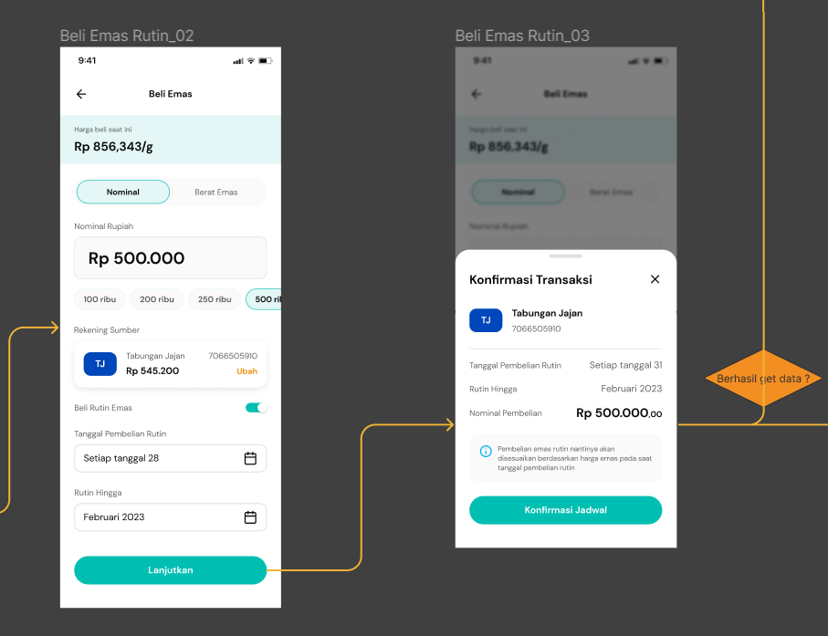
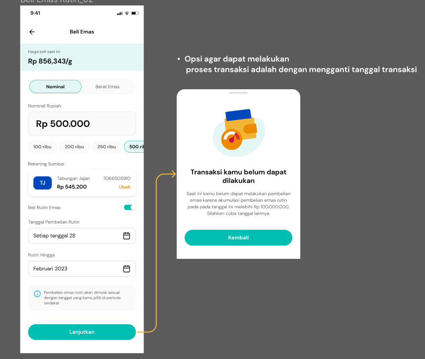
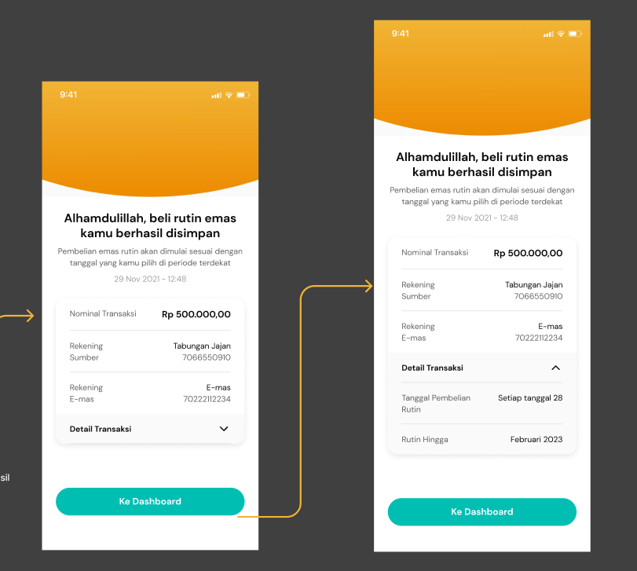
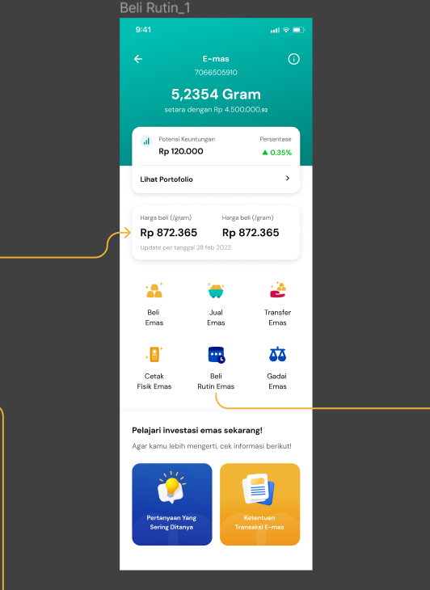
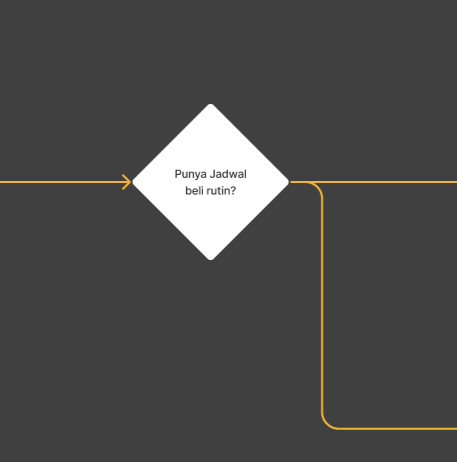

# Emas Invest

Ada 2 garis besar:

1. Beli Rutin Emas dari Tabungan
2. Beli Rutin Emas dari Bagi Hasil
3. History Beli Rutin Emas

## Beli Rutin Emas dari Beli Biasa

- Data parameter yang dibutuhkan :

```bash
- minimal pembelian
- maksimal pembelian
- akumulasi pembelian emas rutin sesuai parameter nominal transaksi maksimal
```

- Layar dimana Front End akan hit API `/inquiry`



- Data yang dikirimkan ke backend saat `Konfirmasi Jadwal` atau saat hit API `/inquiry`

```json
{
  "accountIndex": "",
  "routinePurchaseDate": "",
  "routineUpTo": "",
  "purchaseNominal": ""
}
```

- Ada pengecekan bahwa Transaksi tidak dapat dilakukan, berikut layarnya:



- Ketika lolos validasi, maka akan menampilkan `Terms and Conditions`

- Jadi response dari backend untuk API `/inquiry` sebagai berikut:

```json
{
  "isOpeningScheduledGold": true,
  "routinePurchaseDate": "",
  "routineUpTo": "",
  "purchaseNominal": "",
  "errorCode": "",
  "errorMessage": "",
  "idnMessage": "",
  "engMessage": ""
}
```

- Berikut adalah layar ketika pembukaan transaksi emas terjadwal berhasil:



## Beli Rutin Emas

Ada 2 alur bisnisnya:

1. Beli rutin emas melalui tabungan
2. Beli rutin emas melalui bagi hasil

### Dari Portfolio Dashboard Emas



1. Nasabah akan memilih menu `Beli Rutin Emas`
2. Lalu akan ada pengecekan `Punya jadwal rutin`



## History Beli Rutin Emas
