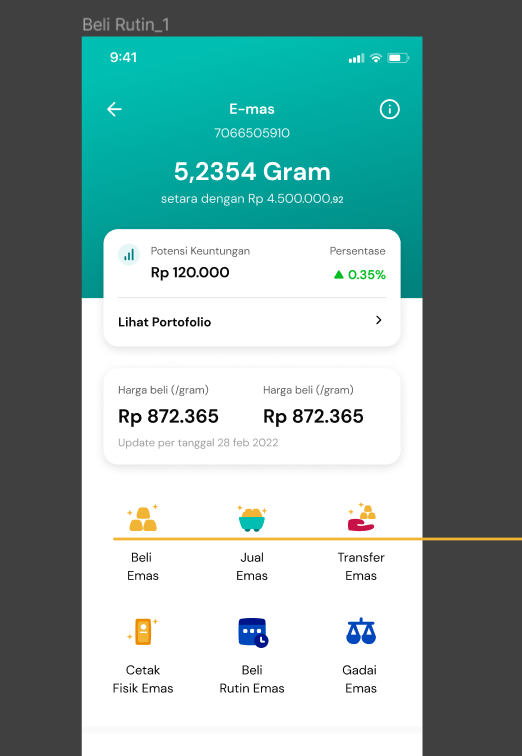
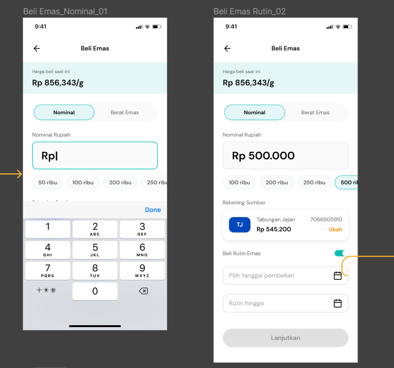
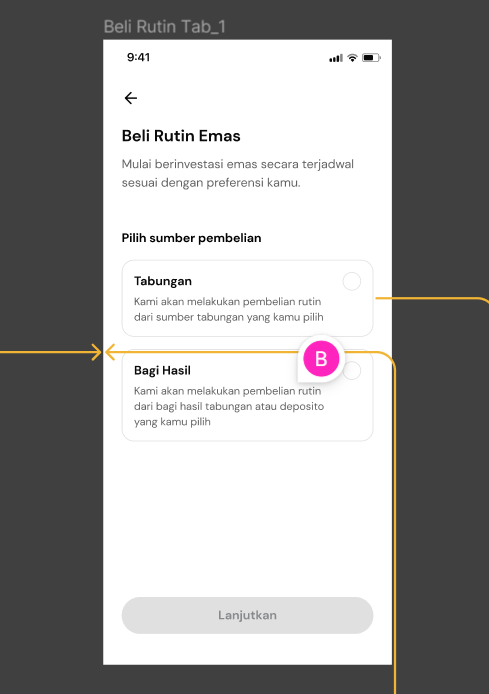
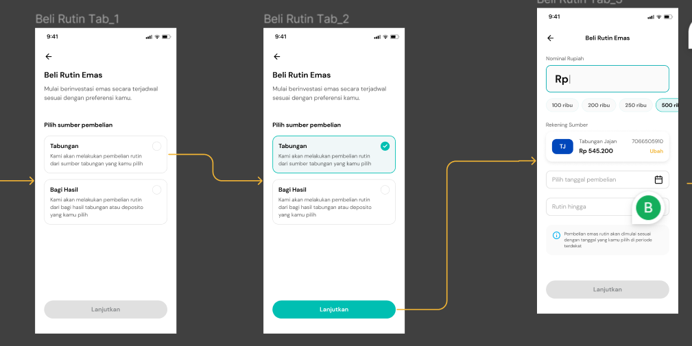
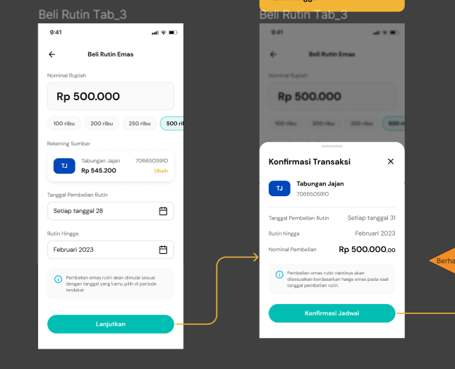
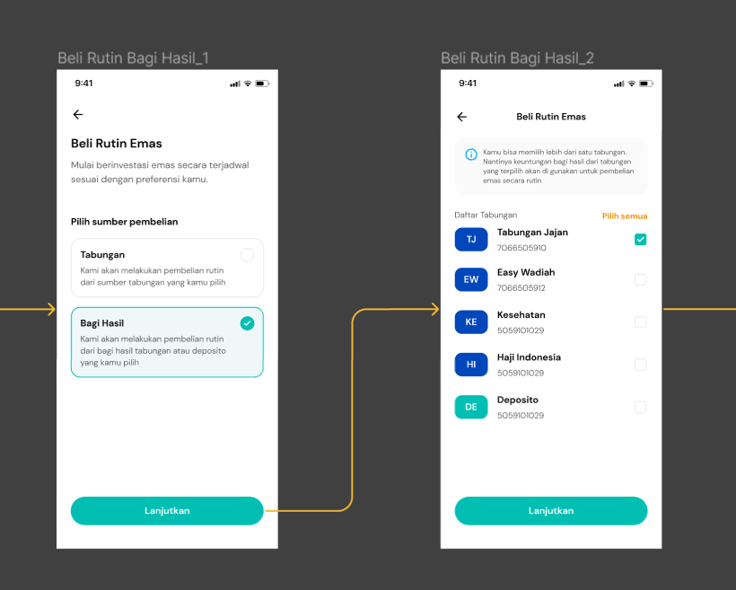
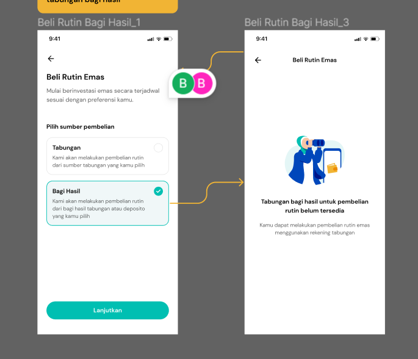
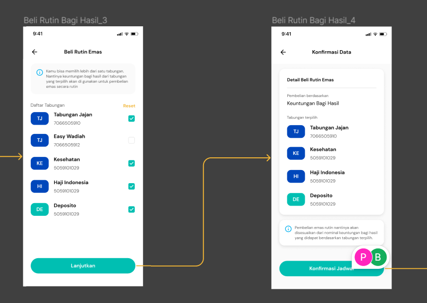
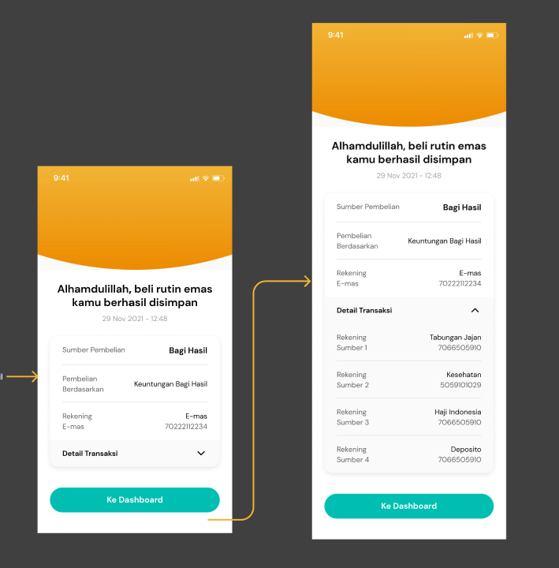
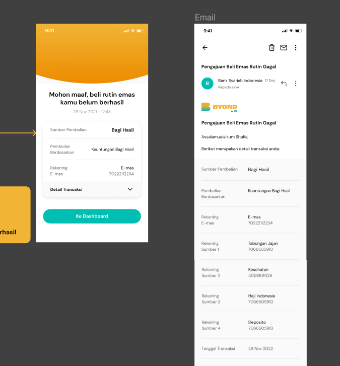

# Emas Invest

Ada 2 garis besar:

1. Beli Rutin Emas dari Tabungan
2. Beli Rutin Emas dari Bagi Hasil
3. History Beli Rutin Emas

## Beli Rutin Emas dari Beli Biasa

- Layar awal beli rutin emas dimulai dari dashboard emas di menu `Beli Rutin Emas`



- Saat user memilih menu `Beli Rutin Emas`, maka akan menampilkan layar berikut:



- Pada layar simulasi perhitungan emas, membutuhkan beberapa data parameterize.
- Data parameter yang dibutuhkan :

```bash
- minimal pembelian
- maksimal pembelian
- akumulasi pembelian emas rutin sesuai parameter nominal transaksi maksimal
```

- Layar dimana Front End akan hit API `/inquiry`


- Data yang dikirimkan ke backend saat `Konfirmasi Jadwal` atau saat hit API `/inquiry`

```json
{
  "accountIndex": "",
  "routinePurchaseDate": "",
  "routineUpTo": "",
  "purchaseNominal": ""
}
```

- Ada pengecekan bahwa Transaksi tidak dapat dilakukan, berikut layarnya:


- Ketika lolos validasi, maka akan menampilkan `Terms and Conditions`

- Jadi response dari backend untuk API `/inquiry` sebagai berikut:

```json
{
  "isOpeningScheduledGold": true,
  "routinePurchaseDate": "",
  "routineUpTo": "",
  "purchaseNominal": "",
  "errorCode": "",
  "errorMessage": "",
  "idnMessage": "",
  "engMessage": ""
}
```

- Berikut adalah layar ketika pembukaan transaksi emas terjadwal berhasil:


## Beli Rutin Emas

Ada 2 alur bisnisnya:

1. Beli rutin emas melalui Tabungan
2. Beli rutin emas melalui Bagi Hasil

### Dari Portfolio Dashboard Emas


- Nasabah akan memilih menu `Beli Rutin Emas`
- Lalu akan ada pengecekan `Punya jadwal rutin`


- Jika user `Tidak Punya Tabungan Rutin`, maka akan tampil layar pemilihan `Pilih Sumber Pembelian`, dengan pilihan seperti berikut : `Tabungan` dan `Bagi Hasil`
- Tetapi tabungan rutin yang dicheck hanya khusus Emas. Jadi apakah nasabah sudah punya tabungan beli rutin emas atau belum



#### Pilih Sumber Pembelian Tabungan

- Jika user memilih sumber pembelian Tabungan untuk beli rutin emas, maka layar akan seperti berikut:



- Kemudian di backend akan menyediakan API `/inquiry`
- Request nya :

```json
{
  "accountIndex": "",
  "tanggalPembelianRutin": "",
  "rutinHingga": "",
  "nominalPembelian": ""
}
```



- Disini juga ada pengecekan untuk transaksi bisa dilakukan atau tidak
- Jika lolos pengecekan, maka akan mengembalikan response isOpenSuccess = true, dan errorCode nya tidak ada
- Response nya adalah :

```json
{
  "isOpenSuccess": "",
  "tanggalPembelianRutin": "",
  "rutinHingga": "",
  "nominalPembelian": "",
  "errorCode": "",
  "errorMessage": "",
  "idnMessage": "",
  "engMessage": ""
}
```

#### Pilih Sumber Pembelian Bagi Hasil

- User akan memilih `Bagi Hasil`
- Ada API lagi untuk menyediakan list tabungan yang ada bagi hasilnya



- Ada response jika nasabah tidak memiliki tabungan bagi hasil, seperti layar dibawah ini:



- List tabungan bagi hasil bisa dipilih dalam bentuk checklist



- Pada resi juga akan menampilkan tabungan bagi hasil yang telah di checklist diawal sebelumnya



- Template Code Receipt format HTML

```json
{
  "transactionStatusData": [
    {
      "value": "<font color=\"#F4000000\" size=\"16\" type=\"autosize\" weight=\"bold\">USD ${transactionAmountUSD}</font><br><font color=\"#9E000000\" size=\"14\" weight=\"normal\">Setara IDR ${transactionAmountIDR}</font>",
      "key": "Sumber Pembelian",
      "type": "data",
      "background": "#00FFFFFF"
    },
    {
      "value": "",
      "key": "",
      "type": "line"
    },
    {
      "value": "<font color=\"#F4000000\" size=\"14\" type=\"autosize\" weight=\"normal\">${fromAccountAlias}</font><br><font color=\"#9E000000\" size=\"14\" type=\"autosize\" weight=\"normal\">${fromAccountNumber}</font>",
      "key": "Pembelian\nBerdasarkan",
      "type": "data",
      "background": "#00FFFFFF"
    },
    {
      "value": "",
      "key": "",
      "type": "line"
    },
    {
      "value": "<font color=\"#F4000000\" size=\"14\" type=\"autosize\" weight=\"normal\">USD 1 = IDR ${kursUSDToIDR}</font>",
      "key": "Kurs Beli",
      "type": "data",
      "background": "#00FFFFFF"
    },
    {
      "detailTransaksi": [
        {
          "value": "<font color=\"#F4000000\" size=\"14\" type=\"autosize\" weight=\"normal\">${fromAccountAlias}</font>",
          "key": "Rekening\nSumber 1",
          "type": "data",
          "background": "#00FFFFFF"
        },
        {
          "value": "",
          "key": "",
          "type": "line"
        }
      ]
    }
  ],
  "receiptData": [
    {
      "value": "<font color=\"#F4000000\" size=\"21\" type=\"autosize\" weight=\"bold\">USD ${transactionAmountUSD}</font><br><font color=\"#9E000000\" size=\"14\" weight=\"normal\">Setara IDR ${transactionAmountIDR}</font>",
      "key": "Nominal Transaksi",
      "type": "data",
      "background": "#FFF5E6"
    },
    {
      "value": "<font color=\"#F4000000\" size=\"14\" type=\"autosize\" weight=\"bold\">${fromAccountAlias}</font><br><font color=\"#9E000000\" size=\"14\" type=\"autosize\" weight=\"normal\">${fromBankShortName} • ${fromAccountNumberWithMask}</font>",
      "key": "Rekening\nSumber",
      "type": "data",
      "background": "#00FFFFFF"
    },
    {
      "value": "<font color=\"#F4000000\" size=\"14\" type=\"autosize\" weight=\"bold\">Tabungan Valas</font><br><font color=\"#9E000000\" size=\"14\" type=\"autosize\" weight=\"normal\">${toBankShortName} • ${toAccountNumberWithMask}</font>",
      "key": "Rekening\nPenerima",
      "type": "data",
      "background": "#00FFFFFF"
    },
    {
      "value": "<font color=\"#F4000000\" size=\"14\" type=\"autosize\" weight=\"normal\">USD 1 = IDR ${kursUSDToIDR}</font>",
      "key": "Kurs Beli",
      "type": "data",
      "background": "#00FFFFFF"
    },
    {
      "value": "",
      "key": "",
      "type": "line"
    },
    {
      "value": "<font color=\"#F4000000\" size=\"14\" type=\"autosize\" weight=\"normal\">${coreRefNo}</font>",
      "key": "Nomor Transaksi",
      "type": "data",
      "background": "#00FFFFFF"
    },
    {
      "value": "",
      "key": "",
      "type": "line"
    }
  ]
}
```

- Jika beli rutin emas gagal, maka akan ditampilkan receipt sebagai berikut:



## History Beli Rutin Emas
